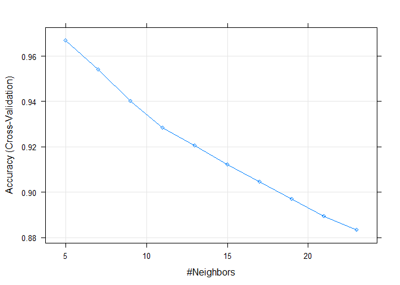

# Human Activity Recognition ML Project
Vladimir Goldin  
August 22, 2015  

### Background

Six young healthy participants were asked to perform one set of 10 repetitions of the Unilateral Dumbbell Biceps Curl in five different fashions: exactly according to the specification (Class A), throwing the elbows to the front (Class B), lifting the dumbbell only halfway (Class C), lowering the dumbbell only halfway (Class D) and throwing the hips to the front (Class E).  
Read more: <http://groupware.les.inf.puc-rio.br/har#ixzz3jcYf6pTX>

In this project, we will attempt to use the HAR dataset to correctly classify the fashion in which the Unilateral Dumbbell Biceps Curl exercise was performed.

### Load the data


```r
library(caret)
```

```
## Loading required package: lattice
## Loading required package: ggplot2
```

```r
pml_full <- read.csv("pml-training.csv")
```

### Feature Extraction

`str(pml_full)` reveals that many features have `NA` or `#DIV/0!` values. Furthermore, some features are irrelevant for the prediction model (such as features `X`, `user_name`, etc.). And upon closer inspection, many others are derived from the collected instrument data, such as `avg`, `stddev`, etc. 

So, to complete the feature extraction, we will keep only the primary instrument data, with the following derivative data removed: `avg`, `min`, `max`, `var`, `stddev`, `amplitude`, `kurtosis`, `skewness`


```r
pml <- pml_full[,-c(1:7, grep("amplitude|min|max|avg|var|stddev|skewness|kurtosis", names(pml_full), ignore.case = TRUE))]

cols <- ncol(pml)
```

As a result, of the 160 columns in the original dataset, we are left with 53 columns that we'll be using to build our prediction model.

### Partitioning the Data

We will partition the original dataset into training and testing sets, 75% and 25%, respectively.


```r
set.seed(40505)
inTrain <- createDataPartition(y = pml$classe, p = .75, list = FALSE)
training <- pml[inTrain,]
testing <- pml[-inTrain,]
```

### Building a k-Nearest Neighbor Model with Cross-Validation

We've attempted to fit the data using the Partial Least Squares model, which yielded an accuracy rate of only 38%. With such a dismal result, we've decided to abandon the linear regression route altogether.

Instead, since we are dealing with a classification problem, the kNN Model seemed like a sensible choice.


```r
knnFit <- train(training[,1:(cols-1)], training[,cols],
                 method = "knn",
                 preProcess = c("center", "scale"),
                 tuneLength = 10,
                 trControl = trainControl(method = "cv"))

summary(knnFit)
```

```
##             Length Class      Mode     
## learn        2     -none-     list     
## k            1     -none-     numeric  
## theDots      0     -none-     list     
## xNames      52     -none-     character
## problemType  1     -none-     character
## tuneValue    1     data.frame list     
## obsLevels    5     -none-     character
```

For k = 5, the accuracy was 96.7%.

### Cross-Validation Plot


```r
plot(knnFit)
```

 

The plot clearly shows that for k > 5, the model results in progressively worsening accuracy. This makes sense since our dataset consists of only 5 classes: {A, B, C, D, E}

### Predicting on the `testing` set


```r
test_knnFit <- predict(knnFit, newdata = testing[,1:(cols-1)])
(conMat <- confusionMatrix(test_knnFit, testing[,cols]))
```

```
## Confusion Matrix and Statistics
## 
##           Reference
## Prediction    A    B    C    D    E
##          A 1379   13    1    2    0
##          B    6  917   12    0    9
##          C    2   13  828   33    4
##          D    4    3   11  763    3
##          E    4    3    3    6  885
## 
## Overall Statistics
##                                           
##                Accuracy : 0.9731          
##                  95% CI : (0.9682, 0.9774)
##     No Information Rate : 0.2845          
##     P-Value [Acc > NIR] : < 2.2e-16       
##                                           
##                   Kappa : 0.966           
##  Mcnemar's Test P-Value : 0.004074        
## 
## Statistics by Class:
## 
##                      Class: A Class: B Class: C Class: D Class: E
## Sensitivity            0.9885   0.9663   0.9684   0.9490   0.9822
## Specificity            0.9954   0.9932   0.9872   0.9949   0.9960
## Pos Pred Value         0.9885   0.9714   0.9409   0.9732   0.9822
## Neg Pred Value         0.9954   0.9919   0.9933   0.9900   0.9960
## Prevalence             0.2845   0.1935   0.1743   0.1639   0.1837
## Detection Rate         0.2812   0.1870   0.1688   0.1556   0.1805
## Detection Prevalence   0.2845   0.1925   0.1794   0.1599   0.1837
## Balanced Accuracy      0.9920   0.9797   0.9778   0.9719   0.9891
```

The Confusion Matrix shows an accuracy of 97.3% on the `testing` dataset. And the error rate is 2.7%.
